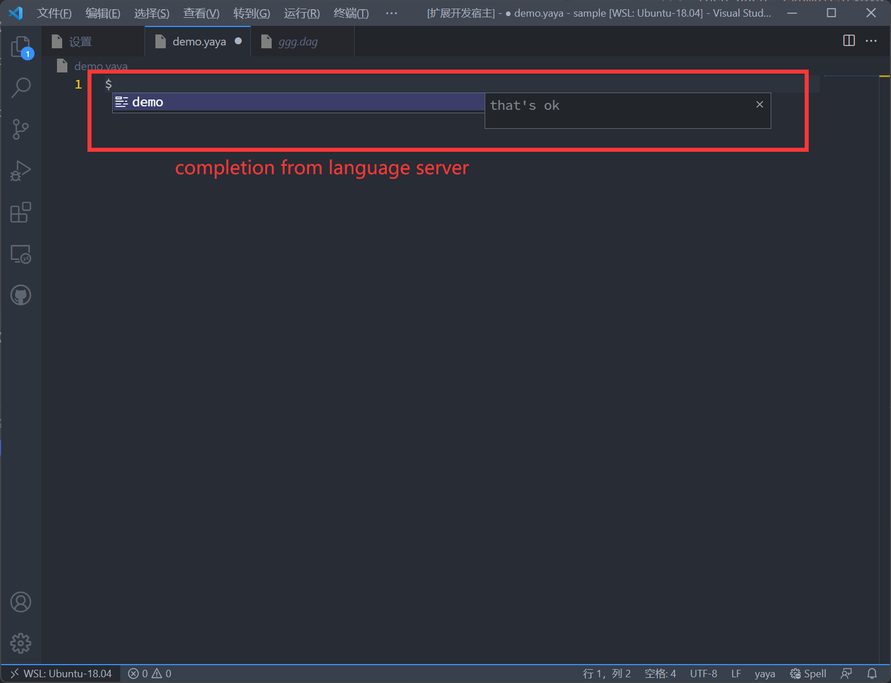

# lsp-types
Native lsp types for rust

## crates

[lsp-types](crates/types/) is where all types and helper trait live in.

[lsp-io](crates/io) is a simple wrapper for reading & writing message for server or client.

## examples

here is a simple demo for creating a lang server and it's vscode extension.

to run lsp server, cd lsp-types, run `cargo run --example yaya-lsp`, then server is starting and waiting for client connection
at `localhost:9999`.

then open `examples/yaya` in another vscode editor, press F5 to start debug extension, open file with `.yaya` extension in **extension debug host**, type `$`, you will see completion from out dummy lsp server.

